# NLP Notes Summary for Predictive Status

Insurance claims analysis application using Natural Language Processing to predict claim outcomes from notes data.

## 📊 Data Architecture (DAG)

The system follows a standardized data processing pipeline based on the micro-level reserving framework:

```mermaid
graph TD
    A[📥 Raw Claims Data<br/>clm_with_amt.csv] --> B[🔄 Data Loader<br/>DataLoader Class]
    A1[📄 Raw Notes Data<br/>notes.csv] --> B1[📝 Notes Processor<br/>NotesReviewerAgent]

    B --> C[🏗️ Claims Transformer<br/>StandardizedClaimsTransformer]
    B1 --> D[🧠 NLP Analyzer<br/>ClaimNotesNLPAnalyzer]

    C --> E[📋 Standardized Schema<br/>DynamicClaimPeriod]
    D --> F[📊 NLP Features<br/>Keyword & Sentiment Analysis]

    E --> G[🔢 Incremental Amounts<br/>incremental_paid<br/>incremental_expense]
    E --> H[📈 Cumulative Amounts<br/>cumulative_paid<br/>cumulative_expense]

    G --> I[⚖️ Normalization<br/>Z-score Normalized]
    I --> J[🎯 ML Features<br/>incremental_paid_normalized<br/>incremental_expense_normalized]

    F --> K[🤖 ML Models]
    J --> K

    K --> L[📈 Baseline Model<br/>Random Forest + NLP]
    K --> M[🚀 Enhanced Model<br/>+ TF-IDF Features]
    K --> N[🎯 NER Model<br/>+ Named Entity Recognition]

    L --> O[📊 Predictions<br/>PAID/DENIED/CLOSED]
    M --> O
    N --> O

    style A fill:#e1f5fe
    style A1 fill:#e8f5e8
    style E fill:#fff3e0
    style J fill:#f3e5f5
    style O fill:#e8f5e8
```



### Key Data Transformations

1. **Raw Input** → **Standardized Periods**: Groups transactions into 30-day periods
2. **Absolute Amounts** → **Incremental Amounts**: Calculates period-over-period changes
3. **Raw Values** → **Normalized Values**: Z-score normalization for ML compatibility
4. **Text Notes** → **NLP Features**: Extracts keywords, sentiment, and entities
5. **Combined Features** → **Predictions**: Three-tier ML model architecture

## Features

### 🤖 Machine Learning Models
- **Baseline Model**: Random Forest with base NLP and financial features
- **Enhanced Model**: Adds TF-IDF text features for improved accuracy
- **NER Model**: Incorporates Named Entity Recognition for maximum performance

### 📊 Analysis Capabilities
- Comprehensive NLP feature extraction from claim notes
- Keyword analysis across 8 insurance-specific categories
- Sentiment analysis and communication frequency metrics
- Pattern analysis for discovering discriminative terms
- Three-way model performance comparison

### 🎯 Key Insights
- Claim status prediction (PAID, DENIED, CLOSED + reopened variants)
- Feature importance analysis by category
- Open claims prediction with confidence scores
- Temporal pattern analysis in claim notes

## Installation

### Quick Start with Virtual Environment

1. **Clone the repository**
   ```bash
   git clone <repository-url>
   cd nlp-notes-summary-for-predictive-status
   ```

2. **Set up virtual environment** (see [setup_environment.md](setup_environment.md) for detailed instructions)
   ```bash
   # Using conda (recommended)
   conda create -n nlp-notes python=3.9 -y
   conda activate nlp-notes

   # Using venv
   python -m venv nlp-notes-env
   source nlp-notes-env/bin/activate  # Linux/Mac
   # nlp-notes-env\Scripts\activate  # Windows
   ```

3. **Install dependencies**
   ```bash
   pip install -r requirements.txt
   python -m spacy download en_core_web_sm
   ```

4. **Place your data files** in the `_data/` directory

5. **Run the application**
   ```bash
   streamlit run app.py
   ```

### Troubleshooting
- For dependency conflicts, see [setup_environment.md](setup_environment.md)
- Ensure numpy version is <2.0.0 for spaCy compatibility

## Usage

The application provides multiple analysis tabs:

1. **📊 Feature Summary**: Overview of NLP features across all claims
2. **🔍 Claim Analysis**: Individual claim deep-dive analysis
3. **📈 Insights**: Patterns and trends by claim status
4. **🤖 ML Baseline**: Train and evaluate baseline Random Forest model
5. **🔬 Pattern Analysis**: Discover discriminative terms and n-grams
6. **🚀 Enhanced Model**: TF-IDF enhanced model with comparison
7. **🎯 NER Model**: Named Entity Recognition model for maximum accuracy

## Model Performance

The system provides incremental model comparison:
- **Baseline → Enhanced**: Shows TF-IDF feature impact
- **Enhanced → NER**: Shows Named Entity Recognition impact
- **Three-way comparison**: Complete performance analysis

## Data Requirements

- **Notes data**: Claim notes with timestamps
- **Claims data**: Claim status, dates, financial information
- **Supported formats**: CSV, Excel, Parquet

## Technical Architecture

### Core Components
- `app.py`: Main Streamlit application
- `helpers/functions/claims_utils.py`: Data processing utilities
- `helpers/functions/nlp_utils.py`: NLP feature extraction
- `helpers/functions/ml_models.py`: Machine learning models
- `helpers/functions/pattern_analysis.py`: Text pattern discovery

### Key Technologies
- **Frontend**: Streamlit
- **ML**: scikit-learn, Random Forest
- **NLP**: NLTK, spaCy, TF-IDF
- **Data**: pandas, numpy
- **Visualization**: matplotlib, seaborn, plotly

## Contributing

1. Create a virtual environment
2. Install development dependencies
3. Follow the existing code structure
4. Add tests for new features
5. Update documentation

## License

[Add your license information here]